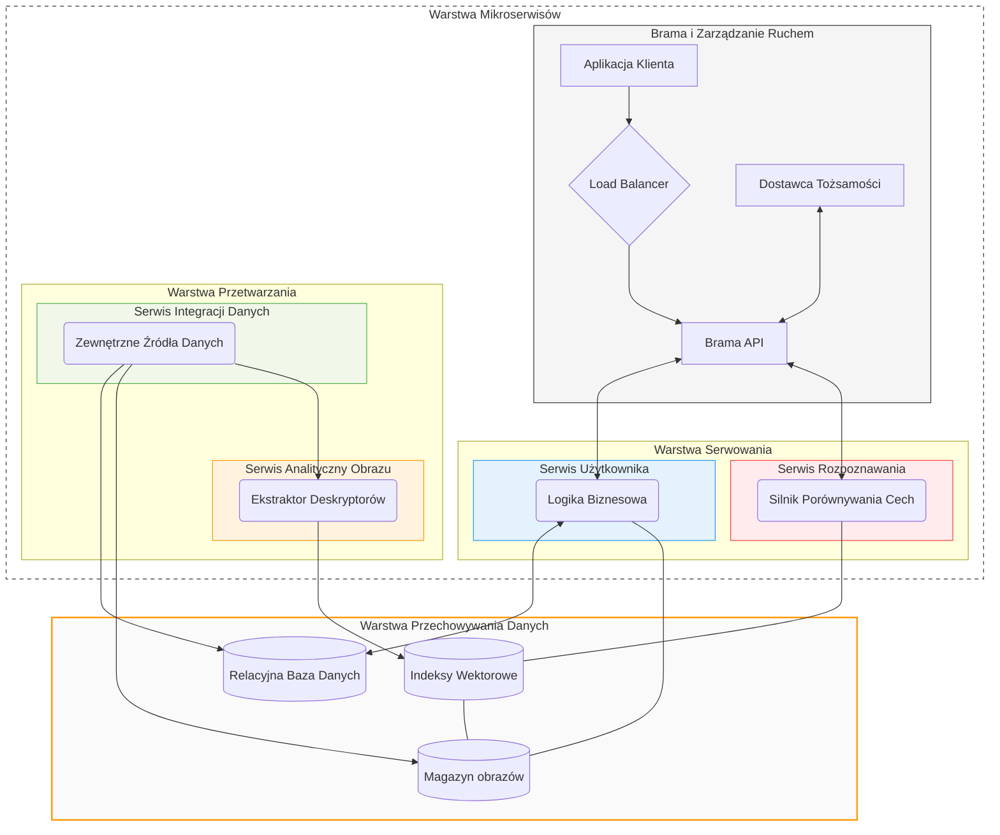

# Kartawarta


# Setup


## Environment

For now use venv
```
python -m venv venv
source venv/Scripts/activate
```

## Requirements
Instal dependencies for each service
```bash
python -m pip install -r kartawarta-backend/requirements.txt
python -m pip install -r kartawarta-vision-backend/requirements.txt
npm --prefix kartawarta-frontend i
```
## Database

Preferably use `docker` to get the `mcr.microsoft.com/mssql/server:2025-latest`, and setup it with 
```bash
DB_PASSWORD = password
DB_USER = sa
DB_SERVER = localhost
DB_PORT = 1433
```

Ensure it is running.

### Prefil database with sample user & TCG entry
Run
```bash
python kartawarta-backend/db/prepare_db.py
```

## Data ingestion
Perform ingestion for your TCG. `riftbound for dev`
```bash
python kartawarta-backend/dataingestion.py -s riftbound
```

# Start services
```bash
python kartawarta-backend/initialize.py
```

```bash
python kartawarta-vision-backend/initialize.py
```

```bash
npm --prefix kartawarta-frontend start
```

# Architecture



