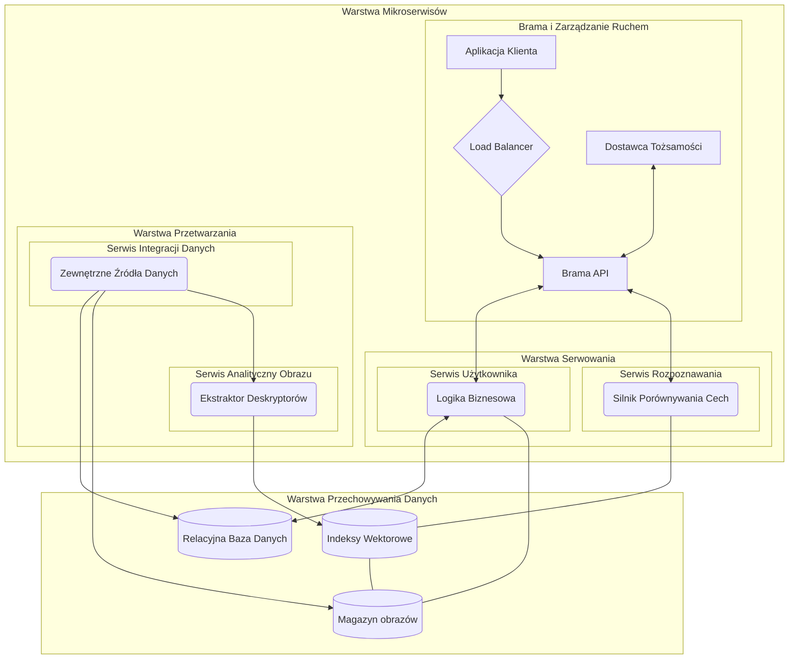
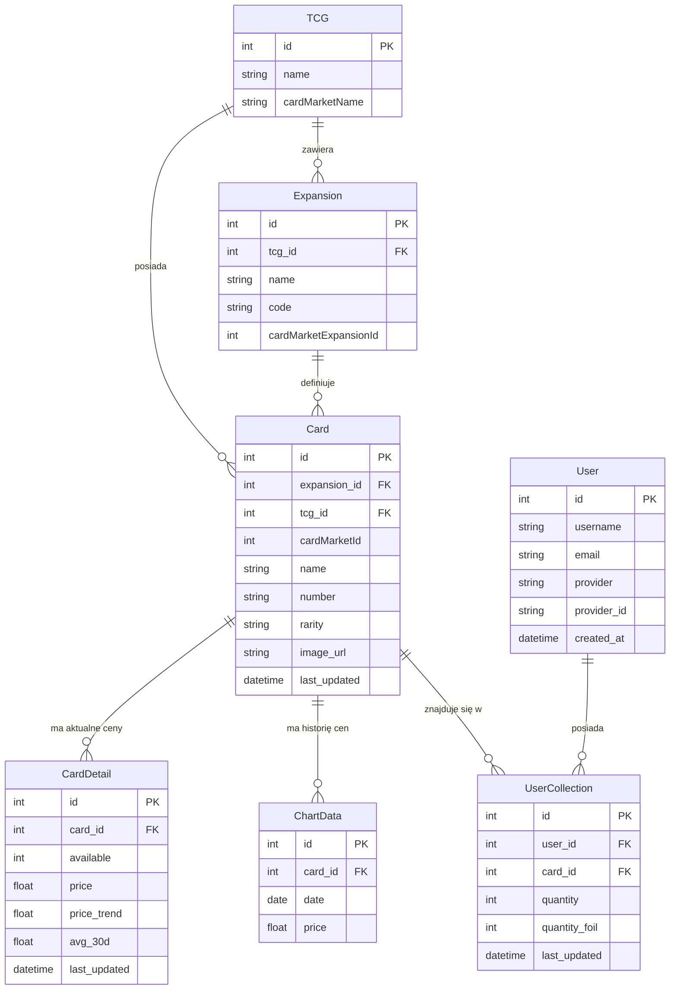

# Kartawarta
A microservices trading‑card app: a React Native + Expo frontend, a Python/FastAPI backend for collections and pricing, and a separate vision service (OpenCV SIFT + FAISS) that identifies cards from photos using Cardmarket data.

# Setup


## Environment

For now use venv
```
python -m venv venv
source venv/Scripts/activate
```

## Requirements
Instal dependencies for each service
```bash
python -m pip install -r kartawarta-backend/requirements.txt
python -m pip install -r kartawarta-vision-backend/requirements.txt
npm --prefix kartawarta-frontend i
```
## Database

Preferably use `docker` to get the `mcr.microsoft.com/mssql/server:2025-latest`, and setup it with 
```bash
DB_PASSWORD = password
DB_USER = sa
DB_SERVER = localhost
DB_PORT = 1433
```

Ensure it is running.

### Prefil database with sample user & TCG entry
Run
```bash
python kartawarta-backend/db/prepare_db.py
```

## Data ingestion
Perform ingestion for your TCG. `riftbound for dev`
```bash
python kartawarta-backend/dataingestion.py -s riftbound
```

# Start services
```bash
python kartawarta-backend/initialize.py
```

```bash
python kartawarta-vision-backend/initialize.py
```

```bash
npm --prefix kartawarta-frontend start
```

# Documentation

## Contents
- Backend API (business logic): [kartawarta-backend](kartawarta-backend/)
- Vision service (SIFT + FAISS): [kartawarta-vision-backend](kartawarta-vision-backend/)
- Frontend (React Native + Expo): [kartawarta-frontend](kartawarta-frontend/)

## 1. Architecture


The system uses a microservice architecture to isolate compute-intensive vision tasks from user/session/collection logic. The frontend communicates with the business API, which in turn queries the vision service to obtain the matched card identifier.

Key concepts:
- Separate card images storage, main relational DB, and descriptor index storage.
- Data ingestion from Cardmarket feeds populates the main DB and the vision-service image corpus.
- Each TCG (trading card game) has its own FAISS index for faster, more accurate matching.

See implementation examples:
- Vision matching: [`match_card`](kartawarta-vision-backend/services/vision.py) in [kartawarta-vision-backend/services/vision.py](kartawarta-vision-backend/services/vision.py)
- Index generation: [`build_faiss_from_images`](kartawarta-vision-backend/services/generate_indexes.py) in [kartawarta-vision-backend/services/generate_indexes.py](kartawarta-vision-backend/services/generate_indexes.py)
- API routes: [kartawarta-backend/api/routes.py](kartawarta-backend/api/routes.py)

## 2. Technology Stack
- Backend services: Python + FastAPI (async endpoints)
- Computer vision: OpenCV SIFT (cv2) + FAISS (IndexIVFPQ)
- Frontend: React Native with Expo (web / Android / iOS)
- Databases: Microsoft SQL Server (main relational DB), sqlite3 (descriptor helper DB)
- Deployment: container-friendly (Dockerfiles present)

Core files:
- Business API entry and routes: [kartawarta-backend/api/routes.py](kartawarta-backend/api/routes.py)
- Strategy-based ingestion logic: [`CardmarketStrategy.import_products_json_to_db`](kartawarta-backend/strategies/base.py) in [kartawarta-backend/strategies/base.py](kartawarta-backend/strategies/base.py)
- DB utilities: [kartawarta-backend/db/db.py](kartawarta-backend/db/db.py)

## 3. Data Model
Relational schema includes TCG, Expansion, Card, CardDetail (prices), ChartData (price history), User, and UserCollection (per-user quantities and foil counts). The vision service stores image files and generates descriptor indexes.



## 4. External Integrations
- Cardmarket Data Tables JSONs are used for:
  - product lists (cards and metadata)
  - daily price guides (price + foil-specific data)
- Ingestion relies on a Strategy pattern to handle TCG-specific quirks during imports and image downloads (see [kartawarta-backend/strategies/base.py](kartawarta-backend/strategies/base.py)).

## 5. Vision Module
- Local-feature extraction: SIFT produces 128-dimensional descriptors per keypoint.
- Indexing: FAISS IndexIVFPQ compresses and indexes descriptors for each TCG.
- Index generation uses parallel extraction and memmap to avoid RAM exhaustion.
- Matching: query descriptors are searched with k-NN, Lowe ratio test (0.75), then a voting scheme selects the best filename.

See code:
- Vision matching: [kartawarta-vision-backend/services/vision.py](kartawarta-vision-backend/services/vision.py)
- Index builder: [kartawarta-vision-backend/services/generate_indexes.py](kartawarta-vision-backend/services/generate_indexes.py)
- Vision API endpoint: [kartawarta-vision-backend/api/endpoints.py](kartawarta-vision-backend/api/endpoints.py)

## 6. Collection Logic & API
- JWT-based auth (Google as identity provider in design).
- Endpoints allow listing TCGs, expansions, cards, card details, and managing per-user collections (/collection).
- Popular card details are cached (LRU) to reduce DB load.

Frontend hooks and context:
- Session management: [`useSession`](kartawarta-frontend/hooks/useAuth.tsx) in [kartawarta-frontend/hooks/useAuth.tsx](kartawarta-frontend/hooks/useAuth.tsx)
- Collection context: [`useCardContext`](kartawarta-frontend/context/CardContext.tsx) in [kartawarta-frontend/context/CardContext.tsx](kartawarta-frontend/context/CardContext.tsx)

## 7. Data Ingestion
- Workflow: fetch expansions → fetch products JSON → fetch price guide JSON → download images → upsert DB.
- Uses batch inserts (executemany) and parallel downloads (ThreadPoolExecutor) to maximize throughput.
- Strategy factory chooses the correct TCG-specific handler. See: [kartawarta-backend/dataingestion.py](kartawarta-backend/dataingestion.py) and [kartawarta-backend/strategies/base.py](kartawarta-backend/strategies/base.py)

## 8. Scalability
- Vision service scales horizontally (multiple instances) — CPU-bound SIFT + FAISS searches.
- Per-TCG indexes reduce search space and latency.
- FastAPI async + semaphores control concurrency for CPU-bound matching.

## 9. UI


https://github.com/user-attachments/assets/28560a62-004e-4dd7-975b-653e9ab8e107


https://github.com/user-attachments/assets/ba49356a-397e-49c3-afb4-d4319a1b8317


## Legal

All card data & prices and pictures of cards comes from https://cardmarket.com/ and all credits for data & images go to them.
